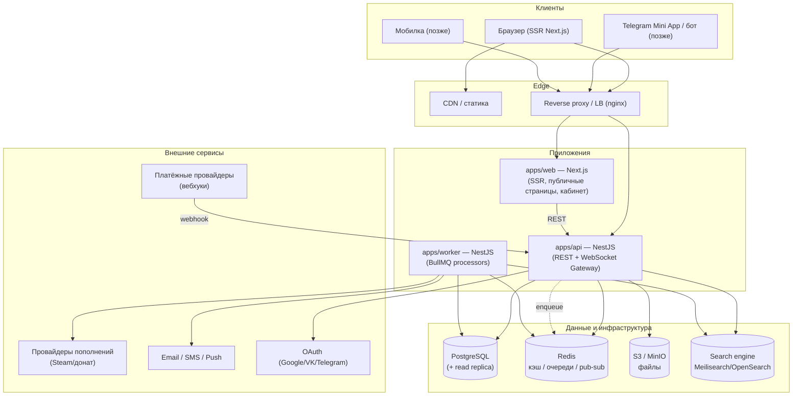
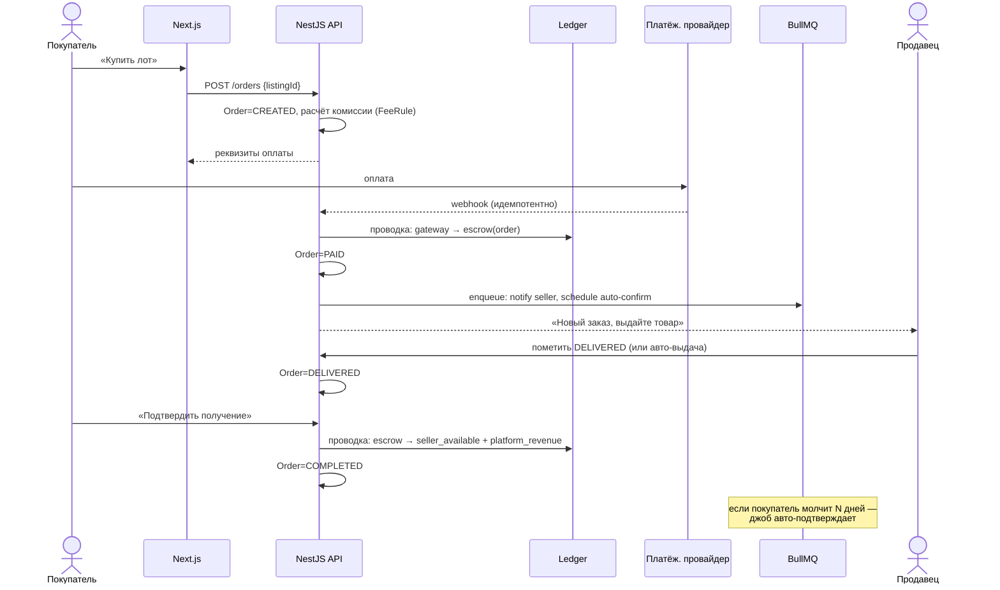

# 01 — Системная архитектура и стек

## 1. Принципы

1. **Modular monolith → микросервисы по необходимости.** Старт — модульный монолит
   на NestJS (чёткие границы модулей), чтобы не платить цену распределённой системы
   до того, как появится нагрузка. Денежное ядро выносится в сервис первым, когда понадобится.
2. **Деньги — строго и аудируемо.** Двойная запись, идемпотентность, неизменяемый журнал.
3. **SSR-first для публичного фронта.** Органика — главный канал (см. [07](07-search-and-seo.md)).
4. **Асинхронность через очереди.** Выдача, уведомления, вебхуки, антифрод — в воркерах.
5. **Типобезопасность сквозная.** Общие типы/контракты в `packages/shared`, валидация Zod.
6. **Конфигурация — данные, не код.** Комиссии, лимиты, категории, атрибуты — в БД.

## 2. Выбор стека и обоснование

| Слой | Выбор | Почему именно так |
|------|-------|-------------------|
| Язык | **TypeScript** (везде) | Один язык фронт+бэк, общие типы, большой найм |
| Монорепо | **pnpm workspaces + Turborepo** | Кэш сборок, общие пакеты, атомарные изменения |
| Backend | **NestJS** | Модульность, DI, гварды/интерсепторы, WS, очереди, зрелость |
| Frontend | **Next.js (App Router, RSC)** | SSR/ISR для SEO, серверные компоненты, маршрутизация |
| ORM | **Prisma** | Типобезопасные миграции и клиент; raw SQL для ledger-критичных мест |
| БД | **PostgreSQL** | Транзакции, JSONB (атрибуты), FTS, надёжность для денег |
| Кэш/локи/pub-sub | **Redis** | Кэш, rate-limit, распределённые локи, адаптер WS |
| Очереди | **BullMQ** (на Redis) | Ретраи, отложенные джобы (авто-подтверждение), приоритеты |
| Realtime | **Socket.IO + Redis adapter** | Чат, нотификации, статусы «онлайн/печатает» |
| Поиск | **PG FTS/pg_trgm → Meilisearch/OpenSearch** | Старт дёшево, миграция при росте фасетов |
| Объекты | **S3-совместимое (MinIO локально)** | Картинки, вложения чата, файлы ключей |
| Auth | **JWT (access+refresh) в httpOnly cookie, TOTP 2FA, OAuth** | Стандарт, ротация токенов, без vendor-lock |
| Платежи | **Абстракция `PaymentProvider`** | RU-рынок «серый» → нужна сменяемость провайдеров |
| API-контракт | **REST + OpenAPI/Swagger** + WS-события | Публичность, мобилки, генерация клиентов |
| Валидация | **Zod** (общие схемы DTO) | Один источник правды фронт/бэк |
| Логи/трейсы/метрики | **pino + OpenTelemetry + Prometheus/Grafana + Sentry** | Наблюдаемость денег и инцидентов |
| Контейнеризация | **Docker + Compose (локально), K8s-ready** | Воспроизводимость, путь в прод |

> ⚖️ **Альтернативы, которые сознательно отклонены сейчас:** Drizzle вместо Prisma
> (рассмотрим, если упрёмся в перф ORM), tRPC вместо REST (теряем публичный контракт),
> GraphQL (избыточно для старта), Kafka (BullMQ достаточно до больших объёмов).

## 3. Компоненты системы (C4: контейнеры)



## 4. Модули backend (границы домена)

NestJS-модули — будущие границы для выделения в сервисы:

```
api/src/modules/
  auth/            — регистрация, логин, refresh, 2FA, OAuth, сессии
  users/           — профили, рейтинги, настройки, KYC
  catalog/         — игры, категории, атрибуты, лоты (listings)
  inventory/       — склад ключей/кодов для авто-выдачи
  search/          — индексация и запросы поиска
  orders/          — сделки, машина состояний, выдача (fulfillment)
  ledger/          — двойная бухгалтерия, счета, проводки (ядро денег)
  payments/        — депозиты, вебхуки, провайдеры (абстракция)
  payouts/         — выводы средств, холды
  wallet/          — пользовательский кошелёк (вьюха поверх ledger)
  chat/            — диалоги, сообщения, WS-gateway, маскирование
  reviews/         — отзывы и агрегаты рейтинга
  disputes/        — споры, арбитраж, резолюции
  trust/           — антифрод, риск-скоринг, репорты, блокировки
  moderation/      — очередь модерации, действия, аудит
  notifications/   — email/push/in-app, шаблоны
  promotions/      — промокоды, продвижение лотов
  admin/           — управление платформой, настройки, RBAC
  shared/          — common: guards, interceptors, фильтры, конфиг
```

## 5. Сквозной поток: покупка с эскроу (happy path)



Полная машина состояний и проводки — в [03](03-escrow-and-ledger.md).

## 6. Стратегии выдачи (fulfillment) — расширяемость гибрида

`Order` ссылается на `FulfillmentStrategy` по типу лота:

| Стратегия | Когда | Как работает |
|-----------|-------|--------------|
| `ManualHandover` | аккаунты, валюта, услуги | Продавец передаёт данные в чате, помечает DELIVERED |
| `AutoKeyDelivery` | ключи/цифра | Воркер резервирует ключ из `inventory`, выдаёт после PAID |
| `ProviderTopUp` | пополнения/донат | Воркер вызывает провайдера, отслеживает статус |

Каждая стратегия — отдельный обработчик в `orders/fulfillment/`, общий интерфейс.
Это и есть «гибрид на одном ядре» из [00](00-vision-and-scope.md).

## 7. Согласованность и надёжность

- **Транзакции БД** для всех денежных операций; ledger-проводки атомарны.
- **Идемпотентность**: ключ на платежах, вебхуках, выдаче (`Idempotency-Key` / `providerRef`).
- **Outbox-паттерн**: события для воркеров пишутся в БД в той же транзакции, затем
  доставляются в очередь (надёжная доставка без потерь).
- **Распределённые локи** (Redis) на критичных секциях (резерв ключа, выплата).
- **Read-replica** для каталога/поиска; запись денег — только на primary.

## 8. Среды (environments)

| Среда | Назначение | Данные |
|-------|-----------|--------|
| `local` | Docker Compose на машине разработчика | seed-данные |
| `ci` | Прогон тестов/миграций в GitHub Actions | эфемерные |
| `staging` | Прод-подобная, интеграционные тесты, демо | анонимизир. |
| `production` | Боевая | реальные |

Подробнее — [08](08-infrastructure-devops.md).
