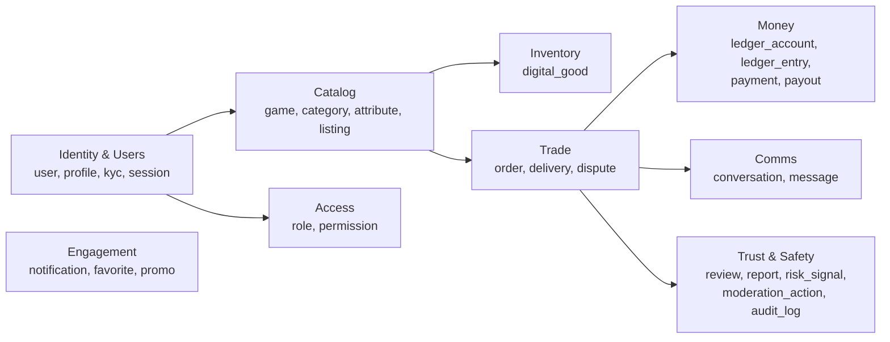
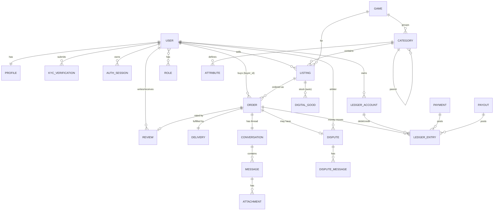

# 02 — Доменная модель и ER

> Соглашения: все таблицы с `id (uuid)`, `created_at`, `updated_at`. Деньги хранятся в
> **минорных единицах** (копейки) типом `BIGINT` + код валюты `CHAR(3)` (ISO 4217).
> Удаления — мягкие (`deleted_at`) там, где нужен аудит. Атрибуты лотов — гибкий
> `JSONB` поверх схемы атрибутов категории.

## 1. Карта доменов

## 2. ER-диаграмма (ядро)

## 3. Сущности по доменам

### 3.1 Identity & Users

**`user`** — учётная запись (auth-уровень).
`id, email (unique, nullable если telegram-only), email_verified_at, phone, password_hash,
status (active|frozen|banned), telegram_id, created_at, last_login_at, deleted_at`

**`profile`** — публичная витрина.
`user_id (PK/FK), username (unique slug), display_name, avatar_url, bio, country,
rating_avg (denormalized), rating_count, sales_count, registered_at, online_at`

**`kyc_verification`** — уровни верификации (для повышенных лимитов/выплат).
`id, user_id, level (none|email|phone|document), status (pending|approved|rejected),
document_refs (jsonb, ссылки на S3), reviewed_by, reviewed_at`

**`auth_session` / `refresh_token`** — сессии и ротация токенов.
`id, user_id, refresh_token_hash, user_agent, ip, device_fingerprint, expires_at,
revoked_at` (см. [09](09-security.md))

**`two_factor`** — TOTP-секрет, recovery-коды (зашифрованы).
`user_id, secret_enc, enabled_at, recovery_codes_enc`

### 3.2 Catalog

**`game`** — игра/платформа (CS2, Steam, Genshin, …).
`id, slug (unique), title, icon_url, cover_url, is_active, sort_order`

**`category`** — иерархическая категория внутри игры/сегмента.
`id, game_id (nullable для общих), parent_id, slug, title, segment
(accounts|currency|items|service|key|topup), fulfillment_type (manual|auto_key|provider),
is_active, sort_order`

**`attribute`** — описание поля фильтра/характеристики категории (EAV-схема в JSONB).
`id, category_id, key, label, type (enum|string|int|bool|range), options (jsonb),
is_filter, is_required, sort_order`

**`listing`** — лот продавца. Сердце каталога.
`id, seller_id, game_id, category_id, title, description, price (bigint), currency,
attributes (jsonb), images (jsonb), stock (int|null для ручных), status
(draft|active|paused|sold_out|blocked), fulfillment_type, auto_delivery (bool),
delivery_template (text, для авто-инструкций), views_count, sales_count,
boost_until (nullable), created_at`
Индексы: FTS по `title+description`, GIN по `attributes`, btree по `category_id, price`.

### 3.3 Inventory (авто-выдача)

**`digital_good`** — единица склада (ключ/код) для авто-лотов.
`id, listing_id, payload_enc (зашифрованный ключ/код), status
(available|reserved|delivered|revoked), reserved_for_order_id, delivered_at`
→ резервируется под распределённым локом при оплате (см. [01](01-architecture.md) §6).

### 3.4 Trade (сделки)

**`order`** — сделка. Машина состояний — [03](03-escrow-and-ledger.md).
`id, public_number (человекочитаемый), buyer_id, seller_id, listing_id,
listing_snapshot (jsonb — фиксируем условия на момент покупки), qty,
amount (bigint), currency, fee_buyer, fee_seller, seller_payout_amount,
status (created|paid|delivered|completed|disputed|refunded|cancelled|expired),
fulfillment_type, paid_at, delivered_at, completed_at, auto_confirm_at, created_at`

**`delivery`** — факт и payload выдачи.
`id, order_id, method (manual|auto_key|provider), payload_ref (jsonb/S3),
provider_ref (string, идемпотентность), status (pending|sent|confirmed|failed),
delivered_at, confirmed_at`

### 3.5 Money (ledger) — детально в [03](03-escrow-and-ledger.md)

**`ledger_account`** — счёт в двойной бухгалтерии.
`id, owner_type (user|platform|external), owner_id (nullable),
kind (available|escrow|revenue|fees_payable|gateway_clearing|payout_payable),
currency, balance (bigint, денормализ. кэш), created_at`

**`ledger_entry`** — проводка (часть сбалансированной транзакции).
`id, txn_id (группирует сбалансированный набор), account_id, direction (debit|credit),
amount (bigint), currency, order_id (nullable), ref_type, ref_id,
idempotency_key, created_at` — **append-only, без UPDATE/DELETE**.

**`payment`** — депозит/оплата (вход денег).
`id, user_id, order_id (nullable), provider, provider_ref (unique), amount, currency,
status (pending|succeeded|failed|refunded), raw_payload (jsonb), created_at`

**`payout`** — вывод средств (выход денег).
`id, user_id, amount, currency, method, destination_enc, status
(requested|approved|processing|paid|rejected), hold_until, approved_by, created_at`

### 3.6 Comms (чат) — детально в [05](05-realtime-chat.md)

**`conversation`** — диалог (по сделке или предпродажный).
`id, order_id (nullable), buyer_id, seller_id, last_message_at, status (open|closed)`

**`message`** — сообщение.
`id, conversation_id, sender_id (nullable для system), type (text|system|attachment),
body, body_masked (с замаскированными контактами), is_flagged, created_at, read_at`

**`attachment`** — вложение (S3).
`id, message_id, url, mime, size, scan_status (pending|clean|infected)`

### 3.7 Trust & Safety — детально в [06](06-trust-safety-antifraud.md)

**`review`** — отзыв по завершённой сделке.
`id, order_id (unique), author_id, target_id, rating (1-5), comment, seller_reply,
created_at`

**`report`** — жалоба (на лот/пользователя/сообщение).
`id, reporter_id, target_type, target_id, reason, details, status, handled_by`

**`risk_signal`** — сигнал антифрода.
`id, user_id, order_id (nullable), type (multiaccount|velocity|chargeback|contact_leak|…),
score, payload (jsonb), created_at`

**`moderation_action`** — действие модератора/системы.
`id, actor_id (nullable=system), target_type, target_id, action
(warn|block|unblock|ban|hide|delete), reason, created_at`

**`audit_log`** — неизменяемый журнал значимых действий (деньги, права, модерация).
`id, actor_id, action, entity_type, entity_id, before (jsonb), after (jsonb), ip, created_at`

### 3.8 Disputes

**`dispute`** — спор по сделке.
`id, order_id (unique), opened_by, reason, status
(open|in_review|resolved_buyer|resolved_seller|cancelled), arbiter_id,
resolution_note, resolved_at, created_at`

**`dispute_message`** — переписка/доказательства в споре.
`id, dispute_id, sender_id, body, attachments (jsonb), is_internal (заметки арбитра)`

### 3.9 Engagement & Access

**`notification`** — `id, user_id, type, channel (in_app|email|push), payload (jsonb), read_at`
**`favorite`** — `id, user_id, listing_id` (избранное/вишлист)
**`promo_code`** — `id, code, type (percent|fixed), value, max_uses, used_count, valid_until`
**`fee_rule`** — комиссии (данные, не код): `id, scope (global|category|seller_tier),
scope_ref, fee_buyer_pct, fee_seller_pct, fee_fixed, currency, priority, active`
**`role` / `permission`** — RBAC (см. [09](09-security.md)):
`role(id, key)`, `permission(id, key)`, `role_permission`, `user_role`.
**`system_setting`** — `key, value (jsonb)` — флаги, лимиты, тексты.

## 4. Ключевые инварианты данных

1. Сумма `debit` = сумма `credit` в каждом `txn_id` (двойная запись).
2. `order.amount = fee_buyer + base_price`; `seller_payout_amount = base_price - fee_seller`.
3. `digital_good` не может быть `reserved` под два разных заказа (уникальный частичный индекс).
4. `review` — ровно один на `order` и только при `status=completed`.
5. `ledger_entry` — только вставка; правки баланса только через компенсирующие проводки.
6. `listing_snapshot` фиксирует цену/условия на момент `order` — лот может меняться позже.

## 5. Стратегия атрибутов (почему JSONB, а не EAV-таблицы)

Категории имеют разный набор полей (ранг, сервер, регион, уровень…). Храним значения
в `listing.attributes (jsonb)`, а **схему** — в таблице `attribute`. Это даёт:
гибкость без миграций под каждую категорию, GIN-индекс для фильтров, валидацию по схеме
на уровне приложения (Zod, сгенерированный из `attribute`). EAV-таблицы оставлены как
запасной вариант, если понадобится строгая реляционная аналитика по атрибутам.
