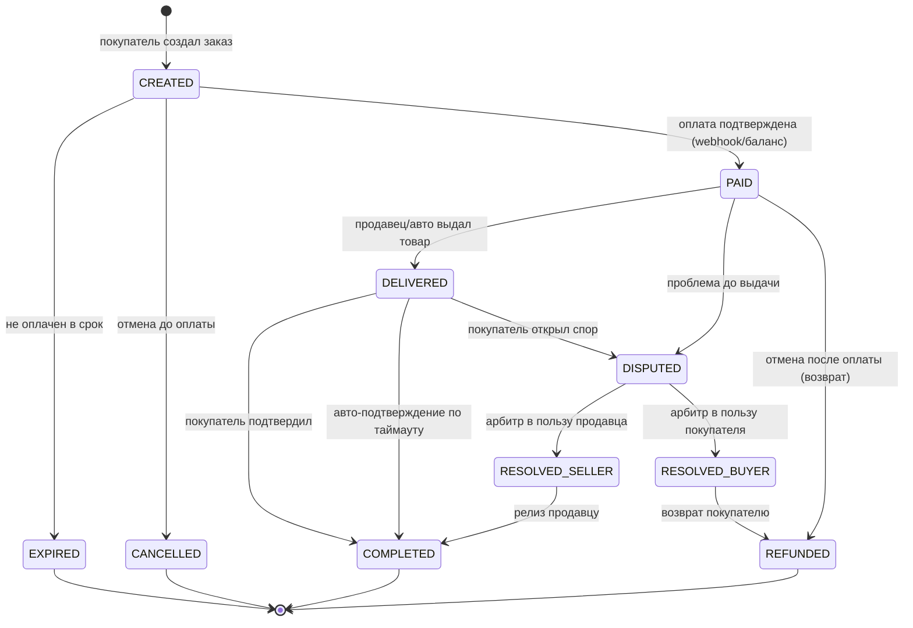

# 03 — Эскроу-сделка и двойная бухгалтерия (ledger)

Это ядро доверия и денег. Здесь нельзя ошибаться: каждое движение денег должно быть
сбалансированным, идемпотентным и аудируемым.

## 1. Машина состояний сделки (Order)



### Переходы и побочные эффекты

| Из → В | Триггер | Денежный эффект | Очередь/таймер |
|--------|---------|-----------------|----------------|
| CREATED → PAID | вебхук провайдера / списание с баланса | проводка **deposit→escrow** | старт таймера авто-отмены снять; нотиф. продавцу |
| CREATED → EXPIRED | таймер (напр. 30 мин) | — | — |
| PAID → DELIVERED | продавец нажал «выдал» / авто-выдача | — | старт таймера авто-подтверждения (`auto_confirm_at`) |
| DELIVERED → COMPLETED | подтверждение покупателя или таймаут | проводка **escrow→seller+revenue** | разрешить отзыв |
| * → DISPUTED | открытие спора | заморозка авто-подтверждения | уведомить арбитра |
| DISPUTED → RESOLVED_BUYER | решение арбитра | проводка **escrow→buyer (refund)** | — |
| DISPUTED → RESOLVED_SELLER | решение арбитра | проводка **escrow→seller+revenue** | — |
| PAID → REFUNDED | отмена/возврат | проводка **escrow→buyer** | — |

**Правила времени (конфигурируемые в `system_setting`):**
- Авто-отмена неоплаченного: `order.payment_ttl` (по умолч. 30 мин).
- Авто-подтверждение после выдачи: `order.auto_confirm_ttl` (по умолч. 72 ч; для авто-товаров короче).
- Окно открытия спора: до COMPLETED и `dispute_window` после (напр. 24 ч).

Реализация: переходы — через единый `OrderStateMachine` сервис, который (1) проверяет
допустимость перехода, (2) выполняет ledger-проводку в **той же БД-транзакции**,
(3) пишет событие в outbox. Никаких прямых `UPDATE order.status` мимо сервиса.

## 2. План счетов (chart of accounts)

Двойная запись: у каждого движения есть дебет и кредит на равную сумму, в одной валюте.

| Счёт (`kind`) | Владелец | Смысл | Норм. сторона |
|---------------|----------|-------|----------------|
| `gateway_clearing` | platform | Транзит денег от/к платёжному провайдеру | — |
| `user:available` | user | Свободный баланс пользователя | кредит |
| `escrow_holding` | platform | Деньги, удерживаемые по активным сделкам | кредит |
| `platform_revenue` | platform | Заработанная комиссия | кредит |
| `platform_fees_payable` | platform | Комиссии провайдерам (расход) | дебет |
| `payout_payable` | platform | Обязательства по выводам | кредит |

> Можно вести **один** общий `escrow_holding` с аналитикой по `order_id` в проводках
> (проще), либо счёт-на-сделку (строже, но много счетов). Берём общий + `order_id`-ссылку
> на каждой проводке — баланс по сделке вычисляется выборкой.

## 3. Денежные потоки (проводки)

Обозначения: `Dr` — дебет, `Cr` — кредит. Все строки одного потока имеют общий `txn_id`
и равны по сумме.

### 3.1 Пополнение баланса (опционально, FunPay-подобно)
```
Dr gateway_clearing      100.00
Cr user:available(buyer) 100.00
```

### 3.2 Оплата заказа (вариант А — с баланса)
```
Dr user:available(buyer) 100.00
Cr escrow_holding        100.00     ; order_id=ORD
```

### 3.2b Оплата заказа (вариант Б — напрямую через провайдера, без баланса)
```
Dr gateway_clearing      100.00
Cr escrow_holding        100.00     ; order_id=ORD
```

### 3.3 Завершение сделки (релиз). Комиссия продавца 10% (= 10.00)
```
Dr escrow_holding              100.00   ; order_id=ORD
Cr user:available(seller)       90.00
Cr platform_revenue             10.00
```

### 3.4 Возврат покупателю (спор в его пользу / refund)
```
Dr escrow_holding        100.00   ; order_id=ORD
Cr user:available(buyer) 100.00
```
(если возврат «наружу» на карту — далее payout-поток на buyer.)

### 3.5 Вывод средств продавцом (payout)
```
Dr user:available(seller) 90.00
Cr payout_payable         90.00      ; payout_id=PO   (при создании заявки)
---
Dr payout_payable         90.00
Cr gateway_clearing       90.00      ; при фактической отправке
```

### 3.6 Комиссия провайдера (эквайринг 2.5%)
```
Dr platform_fees_payable  2.50
Cr gateway_clearing       2.50
```

### Баланс пользователя
`balance(user) = Σ credit(user:available) − Σ debit(user:available)`.
Денормализованный `ledger_account.balance` обновляется в той же транзакции и
периодически сверяется фоновым джобом с суммой проводок (реконсиляция).

## 4. Идемпотентность (защита от двойных движений)

- Каждая проводка несёт `idempotency_key`. Повторная попытка с тем же ключом —
  no-op (уникальный индекс на `(idempotency_key)`).
- Источники ключей: `provider_ref` вебхука, `order_id+transition`, `payout_id+stage`.
- Вебхуки провайдеров: при дубле возвращаем 200, но не проводим повторно.

## 5. Двойная комиссия (модель Playerok)

`FeeRule` задаёт `fee_buyer_pct` и `fee_seller_pct` раздельно. Тогда:
```
order.amount        = base_price * (1 + fee_buyer_pct)     ; платит покупатель
seller_payout       = base_price * (1 - fee_seller_pct)    ; получает продавец
platform_revenue    = order.amount - seller_payout - base_price + base_price
                    = base_price * (fee_buyer_pct + fee_seller_pct)
```
Выбор правила: по `category` → `seller_tier` → `global` (по `priority`). Снапшот
применённых комиссий пишется в `order` (нельзя пересчитывать задним числом).

## 6. Целостность и согласованность

1. **Все проводки — внутри БД-транзакции** перехода состояния. Падение → откат всего.
2. **Append-only**: `ledger_entry` без UPDATE/DELETE. Ошибки правим компенсирующими проводками.
3. **CHECK-инвариант**: на уровне сервиса проверяем Σdebit=Σcredit перед коммитом;
   фоновый аудит проверяет это по всем `txn_id`.
4. **Запрет отрицательного баланса** `user:available` (кроме явно разрешённых счетов) —
   проверка под локом счёта.
5. **Реконсиляция**: ежедневный джоб сверяет `gateway_clearing` с выписками провайдеров.

## 7. Что тестировать в первую очередь (денежное ядро)

- Свойство: для любой последовательности операций Σ всех проводок = 0.
- Идемпотентность: повтор вебхука/перехода не меняет балансы.
- Гонки: два параллельных «подтверждения» одной сделки → ровно один релиз.
- Резерв авто-товара: два заказа на последний ключ → один успех, один отказ.
- Спор после авто-подтверждения вне окна → запрещён.
