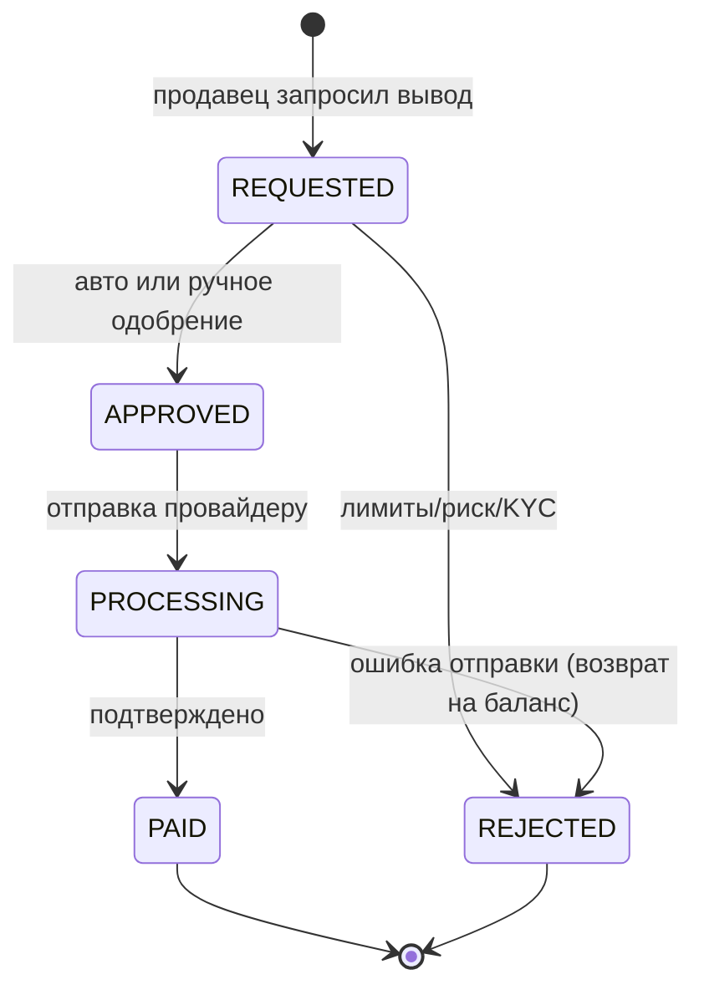

# 04 — Платежи и выплаты

Платёжный ландшафт RU «серый» и подвижный: провайдеры меняются, добавляются СБП,
крипто, card-to-card. Поэтому ключевое архитектурное решение — **абстракция
провайдера**, а не привязка к одному шлюзу.

## 1. Абстракция провайдера

```ts
interface PaymentProvider {
  readonly key: string;                       // 'yookassa' | 'crypto' | 'sbp' | ...
  createDeposit(input: DepositInput): Promise<DepositSession>;   // вернуть ссылку/реквизиты
  parseWebhook(req: RawRequest): WebhookEvent; // верификация подписи + нормализация
  createPayout?(input: PayoutInput): Promise<PayoutResult>;      // если поддерживает выводы
  getStatus(ref: string): Promise<ProviderTxnStatus>;            // реконсиляция
}
```

Реестр провайдеров (`PaymentProviderRegistry`) выбирает реализацию по `payment.provider`.
Добавление нового провайдера = новый класс, без изменений в `orders`/`ledger`.

## 2. Поток депозита/оплаты

```mermaid
sequenceDiagram
    participant Web
    participant Api as API (payments)
    participant Prov as Provider
    participant L as Ledger
    Web->>Api: POST /payments/deposit {orderId|topup, method}
    Api->>Api: создать payment(status=pending, provider_ref)
    Api->>Prov: createDeposit()
    Prov-->>Api: ссылка/реквизиты оплаты
    Api-->>Web: redirect/QR
    Note over Prov: пользователь платит
    Prov-->>Api: webhook (подписан)
    Api->>Api: verify signature, idempotent by provider_ref
    Api->>L: проводка deposit→escrow / →available
    Api->>Api: payment=succeeded; запустить переход Order→PAID
    Api-->>Prov: 200 OK
```

## 3. Вебхуки: правила надёжности

1. **Верификация подписи** провайдера до любой логики.
2. **Идемпотентность** по `provider_ref` (уникальный индекс на `payment.provider_ref`).
   Дубль → 200 OK, без повторной проводки.
3. **Быстрый ответ**: тяжёлую работу — в очередь, вебхук отвечает 200 сразу после
   надёжной фиксации факта (запись в БД/outbox).
4. **Подтверждение суммы/валюты**: сверяем сумму вебхука с ожидаемой по заказу.
5. **Реконсиляция**: джоб опрашивает `getStatus` для «зависших» pending и сверяет
   `gateway_clearing` с выписками провайдера.

## 4. Выплаты (payouts)



- **Холд новичка**: первые N дней / до первой успешной сделки — выплаты задержаны
  (`payout.hold_until`) для защиты от чарджбэков и угонов (см. [06](06-trust-safety-antifraud.md)).
- **Лимиты**: суточные/разовые по уровню KYC и репутации (`system_setting`).
- **Двойное подтверждение** крупных выплат (порог) — ручное одобрение оператором.
- **Проводки**: `available → payout_payable` при заявке; `payout_payable → gateway_clearing`
  при отправке; при ошибке — компенсирующая обратно на `available`.

## 5. Возвраты (refunds)

- Внутренний возврат (на баланс покупателя) — мгновенная проводка `escrow→available(buyer)`.
- Внешний возврат (на карту) — через `PaymentProvider.refund` + payout-поток.
- Частичный возврат — поддержан на уровне сумм проводок (для частично исполненных услуг).

## 6. Мультивалютность (заложить, включить позже)

- Все суммы — минорные единицы + `currency`. Счета ledger — по валютам (нельзя
  смешивать валюты в одной проводке).
- Конвертация — отдельная операция через пару проводок и счёт `fx_clearing` с курсом
  из `system_setting`/провайдера курсов. На старте — одна валюта (RUB).

## 7. Безопасность платежей

- Секреты провайдеров — в секрет-хранилище, не в коде (см. [09](09-security.md)).
- Реквизиты выплат (`payout.destination_enc`) и ключи (`digital_good.payload_enc`) —
  шифрование на уровне приложения (envelope encryption).
- Все денежные эндпоинты — за auth + rate-limit + аудит (`audit_log`).
- Anti-fraud хук перед approve выплаты и перед релизом эскроу.
