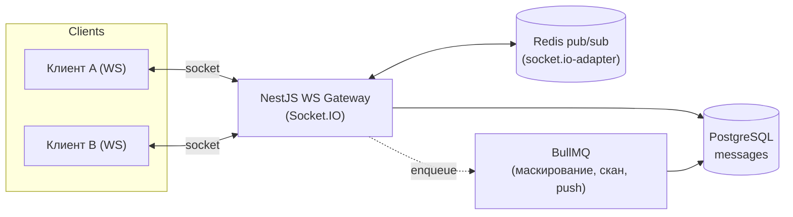
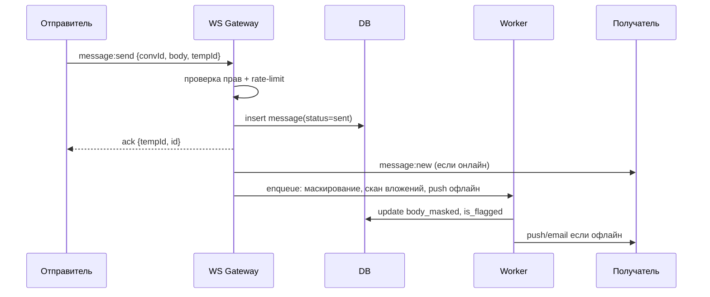

# 05 — Realtime-чат

Чат — место сделки и главный канал для попытки увести покупателя «мимо площадки».
Поэтому это одновременно UX-фича и инструмент Trust & Safety.

## 1. Требования

- Диалоги покупатель↔продавец: предпродажные и привязанные к сделке (`order_id`).
- Доставка в реальном времени, статусы «доставлено/прочитано/печатает/онлайн».
- Вложения (скриншоты, файлы) с антивирус-сканом.
- Системные сообщения от платформы (смена статуса заказа, инструкции выдачи).
- **Маскирование контактов** (телефоны, @ник, ссылки, email) — антискам.
- История переживает перезагрузку; доставка не теряется (persist-then-broadcast).

## 2. Архитектура

- **Socket.IO + Redis adapter** — горизонтальное масштабирование gateway (несколько
  инстансов API делят комнаты через Redis).
- **Комната = `conversation:{id}`**; авторизация при join (участник диалога/арбитр/админ).
- **Persist-then-broadcast**: сообщение сначала пишется в БД (источник правды),
  затем рассылается в комнату. Клиент получает `tempId → realId` ack.

## 3. Поток отправки сообщения

## 4. Маскирование контактов (антискам)

Цель — мешать уводу сделки за пределы эскроу (потеря защиты покупателя и комиссии).

- Детектор: regex + эвристики на телефоны, email, `@username`, ссылки, «телега/вотсап»,
  цифры словами, разрывы символами (`т е л е г а`).
- Поведение настраивается (`system_setting`): `mask` (заменить на `[скрыто]`),
  `flag` (показать, но пометить в антифрод), `block` (не отправлять).
- Хранится и оригинал (`body`, для арбитража/модерации), и `body_masked` (для показа).
- Повторные попытки → `risk_signal(type=contact_leak)` (см. [06](06-trust-safety-antifraud.md)).

> Баланс: слишком агрессивное маскирование злит честных. Поэтому — настраиваемые уровни
> и послабления для верифицированных/высокорейтинговых.

## 5. Вложения

- Загрузка в S3 через pre-signed URL; в сообщении хранится ссылка + метаданные.
- `scan_status`: до `clean` файл не отдаётся получателю (антивирус-воркер).
- Лимиты типов/размера; картинки — превью/ресайз воркером.

## 6. Надёжность и UX-детали

- **Офлайн-доставка**: непрочитанные → push/email через очередь.
- **Дедуп** по `tempId` (повторная отправка при реконнекте не плодит дубли).
- **Бэкофилл**: при реконнекте клиент запрашивает сообщения после `lastSeenId` (REST).
- **Курсоры прочтения**: `message.read_at`; событие `message:read`.
- **Ограничения**: rate-limit на отправку, антиспам новых аккаунтов.

## 7. Модерация и арбитраж

- Арбитр/модератор может открыть диалог в режиме только-чтение (с оригиналами).
- Сообщения нельзя редактировать/удалять бесследно (для доказательной базы спора);
  «удаление» — мягкое, видно модерации.
- Системные сообщения о ключевых событиях сделки пишутся в тот же тред (единая лента).
