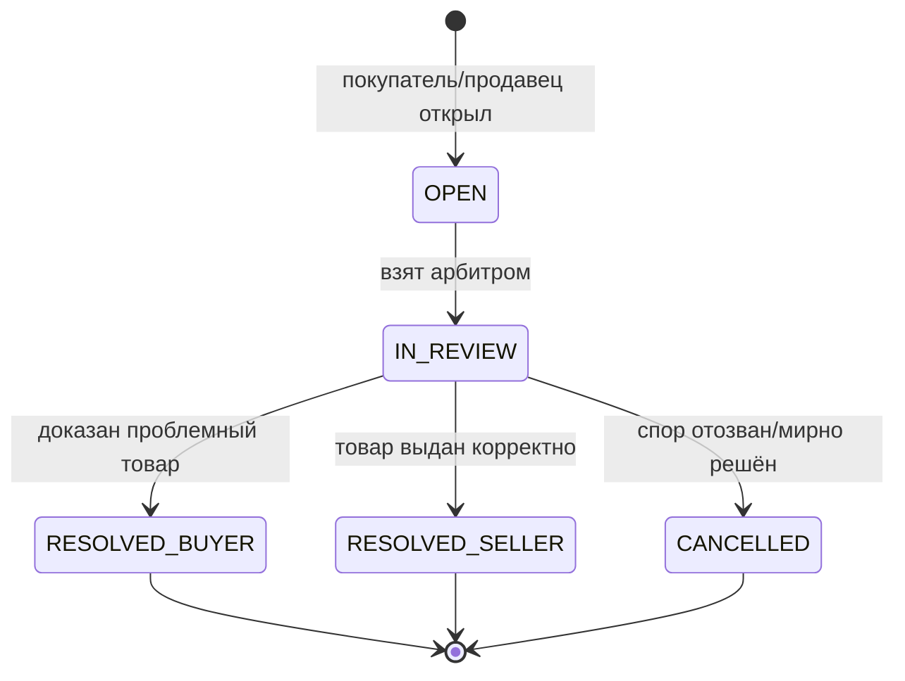

# 06 — Trust & Safety: антифрод, антискам, споры, модерация

Доверие — это продукт. В нише с угонами аккаунтов, чарджбэками и «серым» товаром
T&S напрямую определяет выживание площадки и удержание денег в эскроу.

## 1. Карта угроз

| Угроза | Кто страдает | Контрмера |
|--------|--------------|-----------|
| Увод сделки мимо площадки | площадка (комиссия), покупатель (защита) | маскирование контактов, выгоды эскроу |
| Скам-продавец (не выдал/фейк) | покупатель | эскроу, споры, рейтинг, холд новичка |
| Скам-покупатель (чарджбэк после получения) | продавец, площадка | холд выплат, KYC, риск-скоринг |
| Угнанный аккаунт-товар | покупатель, правообладатель | проверка продавца, гарантийный период |
| Мультиаккаунты / обход банов | площадка | фингерпринт, граф связей |
| Отмыв через фиктивные сделки | площадка (легал) | паттерн-детекция, лимиты, реконсиляция |
| Спам/фишинг в чате | пользователи | антиспам, скан ссылок, репорты |

## 2. Риск-скоринг

Сигналы (`risk_signal`) собираются по событиям и агрегируются в риск-балл пользователя/заказа:

- Регистрация: возраст аккаунта, fingerprint, повтор IP/устройства/платёжного инструмента.
- Поведение: скорость действий (velocity), попытки слить контакты, паттерн отмен.
- Финансы: история чарджбэков, рассинхрон сумм, необычные суммы/частота.
- Связи: граф «общий девайс/IP/реквизиты» → кластеры мультиаккаунтов.

Скор влияет на: показ капчи, лимиты, длину холда выплат, авто-блок выдачи, очередь модерации.
Реализация — правила в `trust`-модуле (rule engine, конфиг в `system_setting`), позже ML.

## 3. Холды и лимиты (защита от чарджбэков/угонов)

- **Холд выплат новичка**: вывод недоступен до первой завершённой сделки / N дней.
- **Холд по категории риска**: аккаунты Steam дольше держатся (окно чарджбэка).
- **Гарантийный период товара**: для аккаунтов — окно, в которое покупатель может
  оспорить «откат/угон» даже после подтверждения (конфигурируемо по категории).
- **Лимиты** на суммы/частоту по уровню KYC и репутации.

## 4. Споры и арбитраж

- Спор замораживает авто-подтверждение и релиз эскроу.
- В споре: переписка с вложениями (`dispute_message`), внутренние заметки арбитра
  (`is_internal`), доступ арбитра к оригиналу чата сделки.
- Решение арбитра триггерит денежную проводку (refund/release) — см. [03](03-escrow-and-ledger.md).
- SLA, очередь по риску/сумме, шаблоны решений, апелляция к админу.

## 5. Модерация контента и пользователей

- **Очередь модерации**: новые лоты (особенно «серые» категории), репорты, флаги чата.
- Действия (`moderation_action`): warn / hide / block listing / freeze / ban — всё в аудит.
- Авто-фильтры: запрещённые категории, стоп-слова, дубли лотов, демпинг-аномалии.
- Репорты пользователей (`report`) маршрутизируются в очередь с приоритетом по риску.

## 6. Идентичность и устройства

- Device fingerprint (клиентский) + серверные сигналы (IP, ASN, заголовки).
- Связывание сессий/устройств/реквизитов в граф для детекции мультиаккаунтов.
- 2FA обязателен для продавцов с выплатами выше порога (см. [09](09-security.md)).

## 7. Аудит и неотказуемость

- `audit_log` — неизменяемый журнал: деньги, смена прав, действия модерации/арбитража.
- Оригиналы сообщений и доказательств не удаляются физически (доказательная база).
- Все автоматические решения логируются с причиной (объяснимость для апелляций).

## 8. Этапность внедрения

1. **MVP**: эскроу + споры + рейтинги + маскирование контактов + ручная модерация + холд новичка.
2. **Фаза антифрода**: risk_signal + rule engine + граф связей + лимиты по скору.
3. **Зрелость**: ML-скоринг, автоматические решения по типовым спорам, чарджбэк-интеграции.
