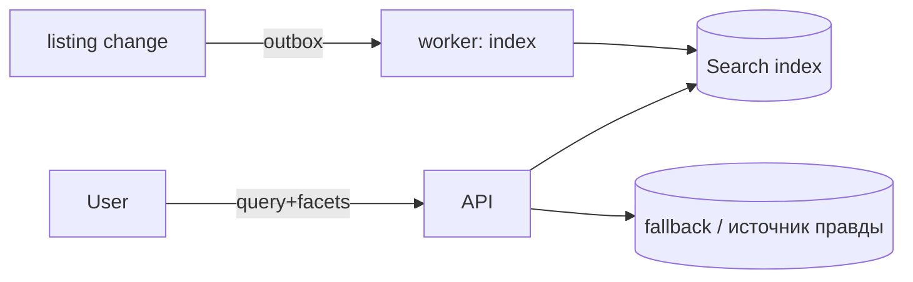

# 07 — Поиск и SEO

Из отчёта по рынку: **органический трафик — главный ров**. У лидера десятки млн визитов
в месяц, и почти всё это — поиск. Значит SEO и качественный поиск по каталогу — не
украшение, а часть фундамента архитектуры.

## 1. Поиск по каталогу

### Этапность
1. **MVP — PostgreSQL**: полнотекст (`tsvector` по `title+description`) + `pg_trgm`
   (опечатки/похожесть) + фильтры по `category_id`, `price`, и атрибутам через GIN по
   `attributes (jsonb)`. Этого достаточно на старте и не плодит инфраструктуру.
2. **Рост — выделенный движок**: **Meilisearch** (быстрый старт, опечатки,
   typo-tolerance, фасеты) или **OpenSearch** (если нужны сложная аналитика/масштаб).
   Индекс наполняется из БД через outbox/воркер при изменении лота.

### Фасетный поиск
Фильтры строятся из схемы `attribute` категории (ранг, сервер, регион…). Фасеты с
подсчётами — ключевой UX маркетплейса. В PG — агрегатные запросы; в Meili — встроенные facets.

### Ранжирование
Сигналы: релевантность текста, буст (`boost_until` — платное продвижение), рейтинг
продавца, свежесть, конверсия лота, наличие. Формула — конфигурируемая.



## 2. SEO — требования к архитектуре

### Рендеринг
- **SSR/ISR (Next.js)** для всех публичных страниц: главная, страница игры, категории,
  страница лота, профиль продавца. Бот и пользователь получают готовый HTML.
- **ISR** (incremental static regeneration) для популярных категорий/лотов — кэш + фон.

### Структура URL (человекочитаемая, стабильная)
```
/                                  — главная
/igra/{game-slug}                  — лендинг игры
/igra/{game-slug}/{category-slug}  — категория (целевая под «купить X»)
/lot/{listing-id}-{slug}           — карточка лота
/prodavec/{username}               — профиль продавца
```
- Канонические URL, 301-редиректы при смене slug, без дублей (trailing slash, регистр).

### Метаданные и разметка
- Уникальные `<title>`/`<meta description>` по шаблонам на категорию/лот.
- **Schema.org JSON-LD**: `Product`, `Offer` (цена, наличие), `AggregateRating`
  (рейтинг продавца), `BreadcrumbList`. → rich snippets в выдаче.
- Open Graph / Twitter cards для шеринга.

### Индексация
- `sitemap.xml` (разбитый по разделам, авто-генерация), `robots.txt`.
- Пагинация и фасеты: продуманный `canonical`/`noindex` для комбинаций фильтров
  (чтобы не плодить мусорные индексируемые URL).
- Хлебные крошки, перелинковка категорий и популярных запросов.

### Производительность (Core Web Vitals)
- TTFB < 200ms (SSR + кэш Redis для горячих страниц).
- Оптимизация изображений (Next/Image, WebP/AVIF, ленивая загрузка, CDN).
- Минимизация JS на публичных страницах (RSC — серверные компоненты по умолчанию).

### Контент и i18n
- Лендинги под высокочастотные запросы («купить аккаунт {game}», «{game} буст»).
- i18n-готовность (ru → en/др.) с `hreflang`; на старте — ru.

## 3. Внутренняя аналитика поиска

- Логи запросов без результатов → подсказки по контенту/категориям.
- A/B ранжирования, метрики конверсии поиск→сделка.
- Популярные запросы → автогенерация SEO-лендингов.
