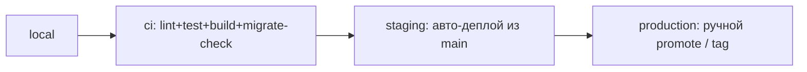

# 08 — Инфраструктура и DevOps

## 1. Локальная разработка (Docker Compose)

Один `docker compose up` поднимает всё окружение:

```yaml
# infra/compose.yaml (план)
services:
  postgres:    # 16, том postgres-data, healthcheck
  redis:       # 7, для кэша/очередей/pub-sub
  minio:       # S3-совместимое хранилище + консоль
  meilisearch: # поиск (этап 2; на старте можно выкл.)
  mailhog:     # перехват писем для разработки
  # api / web / worker запускаются локально (pnpm dev) или тоже в compose
```

- Конфиг — через `.env` (есть `.env.example`, реальный `.env` в `.gitignore`).
- Сиды: скрипт наполнения демо-данными (игры, категории, тестовые лоты/юзеры).
- Миграции БД — Prisma Migrate (`prisma migrate dev` локально).

## 2. Окружения и продвижение изменений



| Среда | Деплой | БД | Назначение |
|-------|--------|----|-----------|
| local | вручную | локальная | разработка |
| ci | автоматом | эфемерная | проверки PR |
| staging | авто из `main` | анонимизированная | интеграция/демо |
| production | ручной promote | боевая | прод |

## 3. CI/CD (GitHub Actions)

Пайплайн на PR:
1. `install` (pnpm, кэш Turborepo).
2. `lint` + `typecheck` (eslint, tsc).
3. `test` (unit + integration; денежное ядро — обязательно, см. [03](03-escrow-and-ledger.md)).
4. `prisma migrate diff` — проверка, что миграции консистентны со схемой.
5. `build` (turbo build всех приложений).
6. (main) `docker build` + push образов → деплой на staging.

Гейты: запрет merge без зелёного CI; миграции ревьюятся отдельно; денежные модули —
обязательный кодревью.

## 4. Контейнеризация и прод

- Каждое приложение (`web`, `api`, `worker`) — свой Docker-образ (multi-stage build).
- Прод-цель: Kubernetes (Helm-чарты) или managed-контейнеры; начать можно с одного VPS
  + Compose, но образы и конфиги сразу K8s-ready (12-factor).
- Горизонтальное масштабирование: `api` и `worker` — stateless (состояние в PG/Redis).
- БД: managed PostgreSQL с бэкапами PITR + read-replica для каталога/поиска.

## 5. Конфигурация (12-factor)

- Вся конфигурация — через env; типобезопасная загрузка (Zod-схема конфига при старте).
- Секреты — отдельно от env-файлов (см. [09](09-security.md)): Vault / cloud secrets / SOPS.
- Фичефлаги и операционные параметры (комиссии, лимиты, тексты) — в БД (`system_setting`),
  меняются без релиза.

## 6. Observability

| Сигнал | Инструмент | Что покрывает |
|--------|-----------|---------------|
| Логи | **pino** (структурные JSON) → Loki/ELK | запросы, ошибки, денежные операции |
| Трейсы | **OpenTelemetry** → Tempo/Jaeger | сквозные трейсы API→worker→БД |
| Метрики | **Prometheus + Grafana** | RPS, латентности, очереди, бизнес-метрики |
| Ошибки | **Sentry** | исключения фронта и бэка |
| Алерты | Alertmanager / Sentry alerts | падение оплат, рост ошибок, лаг очередей |

Бизнес-дашборды: GMV, конверсия, средний чек, время выдачи, доля споров, лаг выплат.

## 7. Бэкапы и аварийное восстановление

- PostgreSQL: автоматические бэкапы + PITR; регулярные тест-восстановления.
- S3: версионирование + lifecycle-политики.
- Ledger — источник истины по деньгам: отдельная стратегия архивирования, неизменяемость.
- Runbook'и: падение провайдера платежей, рассинхрон ledger, инцидент безопасности.

## 8. Стоимость и масштабирование (прагматично)

Старт дёшево: 1 VPS под Compose (PG+Redis+MinIO+api+web+worker) + CDN для статики.
Рост по узким местам: вынести БД в managed → добавить read-replica → выделить worker'ы →
поднять Meilisearch → перейти на K8s. Не платить за масштаб до того, как он понадобится.
