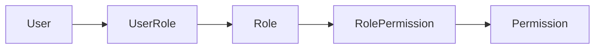

# 09 — Безопасность и аутентификация

Площадка держит чужие деньги и PII продавцов/покупателей. Безопасность — требование,
не фича. Принцип: **least privilege, defense in depth, аудит всего значимого**.

## 1. Аутентификация

- **Методы входа**: email+пароль, OAuth (Google/VK), **Telegram Login** (важно для ниши),
  телефон (SMS) — опционально.
- **Пароли**: Argon2id (или bcrypt cost≥12), политика сложности, проверка по утечкам (HIBP).
- **Токены**: короткоживущий **access JWT** (≈15 мин) + **refresh** (ротируемый,
  хранится хешем в `refresh_token`), оба в **httpOnly + Secure + SameSite** cookie.
- **Ротация refresh + reuse detection**: повторное использование старого refresh →
  отзыв всей цепочки сессий (защита от кражи токена).
- **2FA (TOTP)**: обязателен для продавцов с выплатами выше порога; recovery-коды зашифрованы.
- **Управление сессиями**: список устройств, удалённый logout, привязка к fingerprint/IP.

## 2. Авторизация (RBAC)

- Роли: `buyer`, `seller` (по сути флаги одного пользователя), `agent` (арбитр),
  `moderator`, `finance`, `admin`.
- Проверки — через NestJS Guards + декораторы `@RequirePermission('payout.approve')`.
- Доступ к деньгам/модерации — гранулярные permission'ы, не «роль = всё».
- Серверная проверка владения ресурсом (нельзя купить/изменить чужое по ID).

## 3. Защита данных (PII и секреты)

- **Шифрование в покое** для чувствительного: реквизиты выплат (`payout.destination_enc`),
  ключи/коды (`digital_good.payload_enc`), 2FA-секреты, KYC-документы.
  Envelope encryption: данные шифруются DEK, DEK — KEK из секрет-хранилища.
- **Секреты приложения** (ключи провайдеров, JWT-секрет, ключи шифрования) — в
  Vault / cloud secret manager / SOPS, **никогда в гите** (`.env` в `.gitignore`).
- **TLS везде** (внешний и внутренний трафик). HSTS на публичном домене.
- **Минимизация PII**: храним только необходимое; KYC-документы — с ограниченным доступом и сроком.

## 4. Защита приложения (OWASP)

- **Валидация ввода** — Zod на границе (DTO), и на фронте, и на бэке. Никакого доверия клиенту.
- **SQL-инъекции** — параметризованные запросы (Prisma); raw SQL только параметризованный.
- **XSS** — экранирование, CSP, без `dangerouslySetInnerHTML` для пользовательского контента.
- **CSRF** — SameSite cookie + anti-CSRF токен для мутирующих форм.
- **Rate limiting** — на auth, чат, создание заказов, платежи (Redis-based, по IP+user).
- **Брутфорс/перебор** — экспоненциальные задержки, капча при риске, блокировки.
- **IDOR** — серверная проверка прав на каждый объект.
- **Загрузка файлов** — проверка MIME/размера, антивирус-скан, отдача с отдельного домена.
- **Зависимости** — `pnpm audit`, Dependabot/Renovate, проверка лицензий.

## 5. Безопасность денежных операций

- Все денежные эндпоинты: auth + permission + rate-limit + **запись в `audit_log`**.
- Идемпотентность на платежах/выплатах/вебхуках (см. [03](03-escrow-and-ledger.md), [04](04-payments-and-payouts.md)).
- Проверка подписи вебхуков провайдеров; allowlist IP, если провайдер даёт.
- Лимиты и пороги ручного одобрения для выплат/возвратов.
- Разделение обязанностей: инициатор выплаты ≠ утверждающий (для крупных сумм).

## 6. Аудит и реагирование

- `audit_log` (неизменяемый): аутентификация, смена прав, денежные операции, модерация.
- Алерты на аномалии: всплеск возвратов, неуспешные входы, рассинхрон ledger.
- Incident response runbook: компрометация ключей, утечка, фрод-волна.
- Регулярные ревью прав и секрет-ротация.

## 7. Приватность и комплаенс (заложить заранее)

- Согласия и политика обработки ПДн; экспорт/удаление данных по запросу.
- Возрастные ограничения (некоторый контент 18+).
- Логи доступа к PII; принцип need-to-know для саппорта/модерации.
- Юридическая прослойка (оферта, правила, KYC-уровни) — конфигурируема, т.к. требования
  меняются (см. контекст «серого» рынка в [00](00-vision-and-scope.md)).
