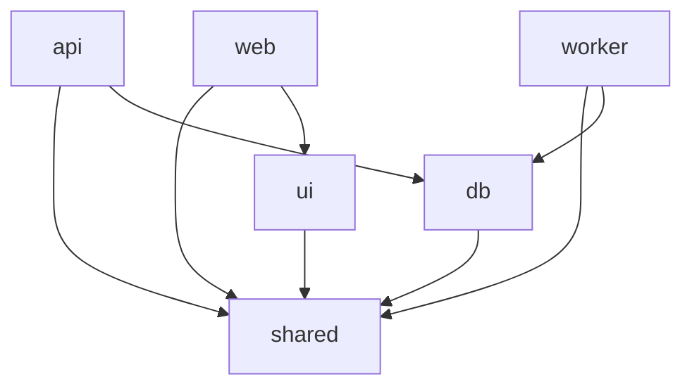

# 10 — Структура монорепо

Монорепо на **pnpm workspaces + Turborepo**: общий код в `packages/`, приложения в
`apps/`, инфраструктура в `infra/`. Это даёт общие типы/контракты, атомарные изменения
фронт+бэк и кэш сборок.

## 1. Раскладка

```
fp-pl/  (gamemarket)
├─ apps/
│  ├─ web/                 # Next.js (App Router) — публичный сайт + кабинет
│  │  ├─ app/              # маршруты (RSC): /, /igra, /lot, /prodavec, /cabinet
│  │  ├─ components/       # UI-композиции
│  │  └─ lib/              # api-клиент, хелперы SSR, SEO-утилиты
│  ├─ api/                 # NestJS — REST + WebSocket Gateway
│  │  └─ src/modules/...   # домены (см. 01-architecture §4)
│  ├─ worker/              # NestJS standalone — BullMQ processors
│  │  └─ src/processors/   # fulfillment, payments, notifications, antifraud, reindex
│  └─ admin/              # (позже) админка/арбитраж — отдельный Next.js или раздел web
│
├─ packages/
│  ├─ db/                  # Prisma schema, миграции, сгенерир. клиент, сиды
│  │  ├─ prisma/schema.prisma
│  │  └─ src/              # репозитории/хелперы доступа
│  ├─ shared/              # типы, DTO, Zod-схемы, константы, доменные enum'ы
│  │  ├─ contracts/        # REST/WS контракты (источник правды фронт↔бэк)
│  │  └─ money/            # типы денег, валюты, утилиты минорных единиц
│  ├─ ui/                  # общие React-компоненты, дизайн-токены
│  └─ config/              # общие конфиги: eslint, tsconfig, prettier, tailwind
│
├─ infra/
│  ├─ compose.yaml         # локальное окружение (postgres/redis/minio/meili/mailhog)
│  ├─ docker/              # Dockerfile'ы приложений (multi-stage)
│  └─ k8s/                 # (позже) Helm-чарты / манифесты
│
├─ docs/                   # ← вы здесь (архитектура)
├─ .github/workflows/      # CI/CD пайплайны
├─ turbo.json              # пайплайны задач (build/lint/test/dev) + кэш
├─ pnpm-workspace.yaml     # описание воркспейсов
├─ package.json            # корневые скрипты
└─ .env.example            # пример конфигурации
```

## 2. Границы зависимостей



- `apps/*` зависят от `packages/*`, но **не друг от друга**.
- `packages/shared` — без зависимостей от приложений (чистые типы/утилиты).
- Контракты API живут в `shared/contracts` → импортируются и фронтом, и бэком
  (один источник правды, нет рассинхрона DTO).

## 3. Соглашения

- **Версии Node/pnpm** зафиксированы (`.nvmrc`, `packageManager` в package.json).
- **Скрипты** единообразны: `pnpm dev`, `pnpm build`, `pnpm lint`, `pnpm test`,
  `pnpm db:migrate`, `pnpm db:seed` (через Turborepo).
- **Code style**: ESLint + Prettier из `packages/config`, общий tsconfig (strict).
- **Коммиты**: Conventional Commits (для авто-changelog и понятной истории).
- **Тесты**: unit рядом с кодом (`*.spec.ts`), интеграционные — `__tests__`, денежное
  ядро — обязательное покрытие свойствами (см. [03](03-escrow-and-ledger.md §7)).

## 4. Порядок первичной сборки каркаса (Фаза 0)

1. `pnpm init` + `pnpm-workspace.yaml` + `turbo.json` + `packages/config`.
2. `packages/db`: Prisma schema (сущности из [02](02-domain-model.md)) + первая миграция.
3. `packages/shared`: базовые типы денег, enum'ы статусов, Zod-контракты auth.
4. `apps/api`: бутстрап NestJS, модуль `auth` + `health`, подключение Prisma/Redis.
5. `apps/web`: бутстрап Next.js, layout, страница каталога-заглушка, api-клиент.
6. `apps/worker`: бутстрап BullMQ, пустой processor + расписание авто-подтверждения.
7. `infra/compose.yaml` + `.env.example` + сиды; `pnpm dev` поднимает всё локально.
8. CI: lint+typecheck+test+migrate-check.

> ⚠️ Предусловие: установить **Node.js (LTS) и pnpm** — сейчас их нет в системе
> (есть только Python 3.9 и git). Это первый шаг Фазы 0.
