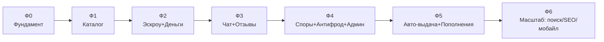

# 11 — Дорожная карта по фазам

Принцип: каждая фаза — поставляемый вертикальный срез, расширяющий ценность, не ломая
денежные инварианты. Сначала надёжное ядро (каталог + эскроу + деньги), потом охват
(авто-выдача, пополнения) и масштаб (антифрод, поиск, SEO).

## Фаза 0 — Фундамент
**Цель:** репозиторий, на котором можно разрабатывать; «hello world» сквозняком.
- Установить Node.js LTS + pnpm (предусловие).
- Монорепо (pnpm + Turborepo), `packages/config`, общий tsconfig/eslint.
- `packages/db`: Prisma-схема ядра ([02](02-domain-model.md)) + первая миграция.
- `apps/api` (NestJS): health, auth-скелет; `apps/web` (Next.js): layout + заглушка.
- `apps/worker`: BullMQ-бутстрап. `infra/compose.yaml`, `.env.example`, сиды.
- CI (lint/typecheck/test/migrate-check).
**Готово, когда:** `pnpm dev` поднимает web+api+worker+инфру; регистрация/логин работают.

## Фаза 1 — Каталог и лоты
**Цель:** можно просматривать и создавать лоты.
- Игры, категории (иерархия), атрибуты; админ-сиды каталога.
- CRUD лотов продавцом, загрузка изображений (S3), статусы лота.
- Публичные страницы (SSR): игра → категория → лот; фильтры/поиск на PG (FTS+GIN).
- Профиль продавца (витрина).
**Готово, когда:** продавец создаёт лот, покупатель находит его поиском/фильтрами.

## Фаза 2 — Эскроу-сделка, кошелёк, деньги
**Цель:** безопасная покупка с удержанием денег. **Самая важная фаза.**
- `ledger` (двойная запись, план счетов, идемпотентность) + тесты-свойства.
- Машина состояний `Order` ([03](03-escrow-and-ledger.md)), таймеры (авто-отмена/подтверждение).
- 1 платёжный провайдер (депозит + вебхук) через абстракцию ([04](04-payments-and-payouts.md)).
- Кошелёк пользователя, базовые выплаты с холдом новичка.
- `FeeRule` (комиссии как данные).
**Готово, когда:** сквозной сценарий create→pay→deliver→confirm→release проходит и
сходится по балансам; повтор вебхука идемпотентен.

## Фаза 3 — Чат и отзывы
**Цель:** коммуникация и репутация.
- WebSocket-чат ([05](05-realtime-chat.md)): диалоги, доставка, прочтение, вложения.
- Маскирование контактов (антискам), системные сообщения по событиям сделки.
- Отзывы/рейтинги по завершённым сделкам, агрегаты в профиле.
- Уведомления (in-app + email).
**Готово, когда:** стороны общаются в реальном времени; после сделки появляется отзыв.

## Фаза 4 — Споры, антифрод, админ/модерация
**Цель:** управляемость и защита от мошенничества.
- Споры/арбитраж ([06](06-trust-safety-antifraud.md)) с проводками решений.
- Антифрод: `risk_signal`, rule engine, граф связей, лимиты/холды по скору.
- Админка: модерация лотов/пользователей, очереди, аудит, управление комиссиями.
- RBAC-роли (agent/moderator/finance/admin), `audit_log` ([09](09-security.md)).
**Готово, когда:** спор проходит цикл до денежного решения; модератор управляет площадкой.

## Фаза 5 — Авто-выдача и пополнения (охват рынка)
**Цель:** высокомаржинальные сегменты (Kupikod/GGSel).
- `inventory` (склад ключей), стратегия `AutoKeyDelivery` (резерв под локом).
- Стратегия `ProviderTopUp`: интеграция провайдеров пополнений Steam/донат.
- Несколько платёжных провайдеров, мультивалютность (вкл.), реконсиляция.
**Готово, когда:** ключ выдаётся автоматически после оплаты; пополнение проходит через провайдера.

## Фаза 6 — Масштаб: поиск, SEO, мобайл
**Цель:** рост органики и удержания.
- Выделенный поиск (Meilisearch/OpenSearch), фасеты, ранжирование.
- Полный SEO-пакет ([07](07-search-and-seo.md)): JSON-LD, sitemaps, лендинги, CWV.
- i18n, Telegram Mini App / бот, публичный B2B-API.
- Зрелый антифрод (ML), автодеры типовых споров.

---

## Сводная таблица приоритетов

| Фаза | Ценность | Риск/сложность | Зависит от |
|------|----------|----------------|-----------|
| 0 Фундамент | Разработка возможна | низкая | — |
| 1 Каталог | Контент/предложение | низкая | 0 |
| 2 Эскроу+Деньги | **Ядро бизнеса** | **высокая** | 1 |
| 3 Чат+Отзывы | Доверие/удержание | средняя | 2 |
| 4 Споры+Антифрод | Защита/управляемость | высокая | 2,3 |
| 5 Авто+Пополнения | Маржа/охват | средняя-высокая | 2 |
| 6 Масштаб | Рост трафика | средняя | 1–4 |

> Денежное ядро (Ф2) и T&S (Ф4) — самые рискованные. Туда — максимум тестов,
> кодревью и времени. Остальное можно итерировать быстрее.
